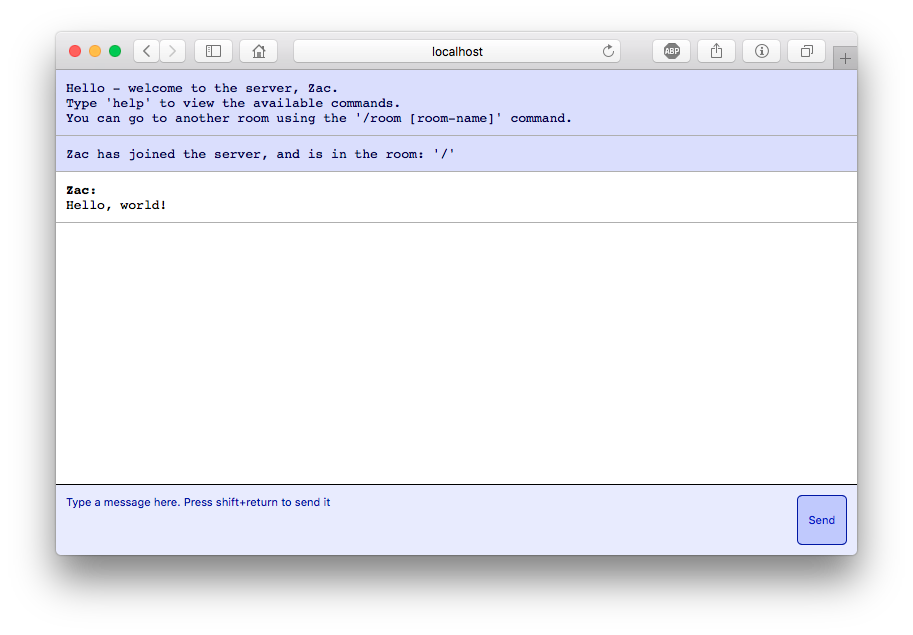

# msg

A messaging web-app written in Go, with some JavaScript too.

It's usable, and has quite a lot of useful features:

  - A login page
    - You don't need to make an account
  - Rooms
    - Rooms don't need to be created either
    - Join a room with `/room [name]`
  - Commands
    - Executed on the server
	- Special command `/script` allows you to execute
	  lots of commands at the same time
  - Easy deployment
    - Just clone the repository and run `main.go`

Here's a screenshot:

There are still a number of things that need doing:

  - Admins
    - Since user's aren't really a thing, there would
	  need to be some other system
  - Instead of global admins, maybe:
    - When joining a new room (one which nobody's been to before,) you become the admin
	  of that room
	- This gives you commands such as `/kick`, `/promote`, etc...
	- Would still need a user system
  - Back up messages to a database (probably Redis)
    - Actually, maybe just a log file
  - Muting other users
  - Limiting amount of messages per minute
  - Improve styles on phones
  - Regularly ping the server to check connection
  - Permalinks for rooms
    - `/room/[name]`
  - Host it somewhere
